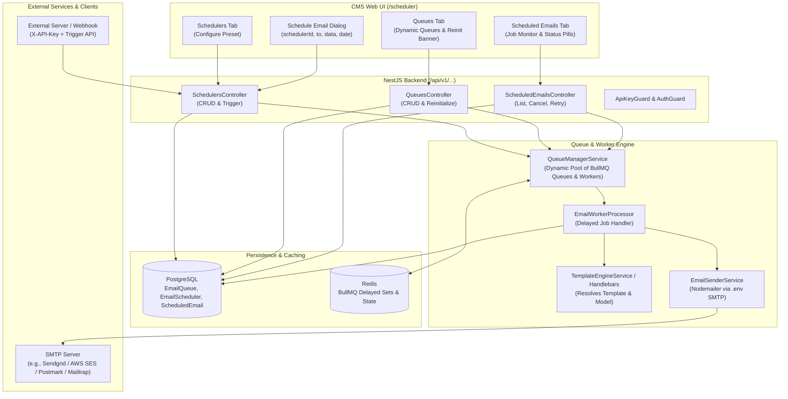
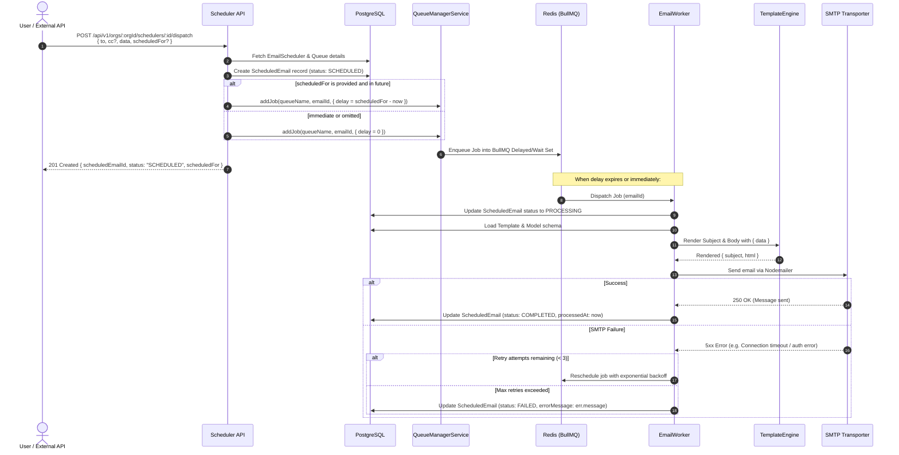

# Email Scheduler & Dynamic Queue Engine — Architecture & Specification Document

## 1. Executive Summary

This specification outlines the architecture, database design, background processing engine, RESTful API, and frontend user interface for the **Email Scheduler & Dynamic Queue Engine**.

The Email Scheduler allows organization members and automated external systems (via API Keys) to configure email delivery pipelines bound to Handlebars templates and schema models, and dispatch delayed or immediate transactional emails powered by **BullMQ** and **Redis**.

The entire capability is housed in its own isolated section (`/scheduler`) in the web dashboard without modifying or polluting existing content or template management flows.

---

## 2. Core Architectural Principles & Decisions

| Decision Area | Chosen Approach | Rationale |
| :--- | :--- | :--- |
| **Entity Structure** | Two-tier model: `EmailScheduler` (reusable pipeline preset) + `ScheduledEmail` (individual execution job) | Decouples template/model/queue mapping configuration from recurring or ad-hoc dispatch instances. Trigger callers only need `{ schedulerId, to, data, scheduledFor? }`. |
| **Queue Engine** | **BullMQ** over Redis with delayed job timers | High performance, memory-efficient Redis primitives with native delayed execution (`opts.delay`), retries, and cancellation support. |
| **Dynamic Queues** | DB-persisted `EmailQueue` registry with runtime worker management | Users can define custom queues in the UI/API. Backend dynamically creates `Queue` and `Worker` instances without requiring server restarts. |
| **Reinitialization Trigger** | `PENDING_INITIALIZATION` state + explicit UI "Reinitialize Queues" action banner | Safe, deterministic runtime worker reloading with full user awareness when new queues are added. |
| **Template & Model Integration** | Modular resolution via `TemplateModule` & `TemplateEngineService` | Dynamically loads template and model schema directly from PostgreSQL/Redis cache at execution time, rendering subject & body with the provided runtime payload. |
| **Email Transport** | Standard SMTP via environment variables (`SMTP_*`) | Strict `.env` configuration; throws a descriptive error immediately if SMTP credentials or host are missing. |
| **Job Lifecycle** | `SCHEDULED` → `PROCESSING` → `COMPLETED` / `FAILED` / `CANCELLED` with 3 retries & backoff | Complete auditability, status persistence in PostgreSQL, and ability to cancel pending delayed jobs. |
| **UI Placement** | Standalone `/scheduler` Hub (3 Tabs: Schedulers, Scheduled Emails, Queues) | Keeps scheduler features cleanly separated from template editing and content entry screens. |

---

## 3. High-Level Architecture Diagram



---

## 4. Execution Sequence Diagram



---

## 5. Database Schema Specifications (Prisma)

Three new models and two enums will be introduced to `prisma/schema.prisma`.

```prisma
enum ScheduledEmailStatus {
  SCHEDULED
  PROCESSING
  COMPLETED
  FAILED
  CANCELLED
}

enum QueueStatus {
  ACTIVE
  PENDING_INITIALIZATION
  PAUSED
  ERROR
}

model EmailQueue {
  id          String      @id @default(uuid())
  orgId       String      @map("org_id")
  name        String      // Unique per org, e.g. "transactional-high", "newsletters"
  description String?
  concurrency Int         @default(5)
  status      QueueStatus @default(PENDING_INITIALIZATION)
  createdAt   DateTime    @default(now()) @map("created_at")
  updatedAt   DateTime    @updatedAt @map("updated_at")

  org             Organization     @relation(fields: [orgId], references: [id], onDelete: Cascade)
  schedulers      EmailScheduler[]
  scheduledEmails ScheduledEmail[]

  @@unique([orgId, name])
  @@map("email_queues")
}

model EmailScheduler {
  id            String    @id @default(uuid())
  orgId         String    @map("org_id")
  queueId       String    @map("queue_id")
  templateId    String    @map("template_id")
  contentTypeId String?   @map("content_type_id") // Optional bound Content Model
  name          String
  description   String?
  defaultTo     String?   @map("default_to")     // Optional fallback recipient
  defaultCc     String?   @map("default_cc")
  isActive      Boolean   @default(true) @map("is_active")
  createdAt     DateTime  @default(now()) @map("created_at")
  updatedAt     DateTime  @updatedAt @map("updated_at")

  org             Organization     @relation(fields: [orgId], references: [id], onDelete: Cascade)
  queue           EmailQueue       @relation(fields: [queueId], references: [id], onDelete: Restrict)
  template        Template         @relation(fields: [templateId], references: [id], onDelete: Restrict)
  contentType     ContentType?     @relation(fields: [contentTypeId], references: [id], onDelete: SetNull)
  scheduledEmails ScheduledEmail[]

  @@index([orgId, isActive])
  @@map("email_schedulers")
}

model ScheduledEmail {
  id            String               @id @default(uuid())
  orgId         String               @map("org_id")
  schedulerId   String               @map("scheduler_id")
  queueId       String               @map("queue_id")
  bullJobId     String?              @map("bull_job_id")
  to            String
  cc            String?
  bcc           String?
  subject       String?
  data          Json                 // The runtime payload merged into the template
  status        ScheduledEmailStatus @default(SCHEDULED)
  scheduledFor  DateTime             @map("scheduled_for")
  processedAt   DateTime?            @map("processed_at")
  attempts      Int                  @default(0)
  errorMessage  String?              @map("error_message") @db.Text
  createdAt     DateTime             @default(now()) @map("created_at")
  updatedAt     DateTime             @updatedAt @map("updated_at")

  org       Organization   @relation(fields: [orgId], references: [id], onDelete: Cascade)
  scheduler EmailScheduler @relation(fields: [schedulerId], references: [id], onDelete: Cascade)
  queue     EmailQueue     @relation(fields: [queueId], references: [id], onDelete: Restrict)

  @@index([orgId, status])
  @@index([orgId, scheduledFor])
  @@index([schedulerId, status])
  @@map("scheduled_emails")
}
```

---

## 6. Dynamic BullMQ Queue & Worker Architecture

### 6.1 `QueueManagerService`
A central NestJS singleton responsible for:
1. **Registry Map**: Maintains runtime `Map<string, { queue: Queue, worker: Worker }>` keyed by `queueId`.
2. **On-Boot Initialization**: Reads all `EmailQueue` records with status `ACTIVE` from PostgreSQL and initializes their BullMQ `Queue` and `Worker` instances using the shared Redis connection.
3. **Dynamic Reinitialization**:
   - Exposed via `POST /api/v1/orgs/:orgId/queues/reinitialize`.
   - Iterates through all queues in the DB for the organization.
   - Gracefully stops any removed or modified workers.
   - Spins up `Worker` and `Queue` for new `PENDING_INITIALIZATION` queues with configured concurrency.
   - Updates queue status to `ACTIVE` in PostgreSQL.
4. **Delayed Scheduling**:
   - Calculates delay: `Math.max(0, new Date(scheduledFor).getTime() - Date.now())`.
   - Adds job with options:
     ```ts
     {
       jobId: scheduledEmail.id,
       delay,
       attempts: 3,
       backoff: { type: 'exponential', delay: 5000 },
       removeOnComplete: 1000,
       removeOnFail: 5000,
     }
     ```
5. **Job Cancellation**:
   - If user cancels an email before execution, `QueueManagerService.cancelJob(queueId, bullJobId)` calls `job.remove()`, and updates the status to `CANCELLED` in PostgreSQL.

### 6.2 Email Sending & SMTP Configuration
The worker delegates actual email sending to `EmailSenderService`:
1. **Environment Check**:
   - Reads:
     - `SMTP_HOST`
     - `SMTP_PORT` (default: 587)
     - `SMTP_SECURE` (true for 465, false for 587)
     - `SMTP_USER`
     - `SMTP_PASS`
     - `SMTP_FROM`
2. **Strict Error Handling**:
   - If `SMTP_HOST` or `SMTP_USER` or `SMTP_PASS` or `SMTP_FROM` is missing in `.env`, the service throws:
     `new Error("SMTP configuration missing in environment variables. Please configure SMTP_HOST, SMTP_USER, SMTP_PASS, and SMTP_FROM.")`
   - The error is captured in `ScheduledEmail.errorMessage` and the job fails predictably.

---

## 7. REST API Endpoints Specification

### 7.1 Schedulers API (`/api/v1/orgs/:orgId/schedulers`)

#### 1. Create Scheduler
- **Endpoint**: `POST /api/v1/orgs/:orgId/schedulers`
- **Auth**: User JWT or Org API Key (`content.create` / `scheduler.manage`)
- **Request Body**:
  ```json
  {
    "name": "Order Confirmation Dispatcher",
    "description": "Sends transactional invoice after checkout",
    "templateId": "tmpl-uuid-1234",
    "contentTypeId": "model-uuid-5678", // optional
    "queueId": "queue-uuid-9999",
    "defaultTo": "billing@customer.com", // optional fallback
    "defaultCc": null
  }
  ```
- **Response (201)**:
  ```json
  {
    "success": true,
    "data": {
      "id": "sched-uuid-001",
      "name": "Order Confirmation Dispatcher",
      "templateId": "tmpl-uuid-1234",
      "queueId": "queue-uuid-9999",
      "isActive": true,
      "createdAt": "2026-09-18T11:00:00.000Z"
    }
  }
  ```

#### 2. List Schedulers
- **Endpoint**: `GET /api/v1/orgs/:orgId/schedulers`
- **Query Params**: `page=1&limit=20&search=order`

#### 3. Update / Delete Scheduler
- **Endpoint**: `PATCH /api/v1/orgs/:orgId/schedulers/:id`
- **Endpoint**: `DELETE /api/v1/orgs/:orgId/schedulers/:id`

---

### 7.2 Dispatch / Trigger API (`/api/v1/orgs/:orgId/schedulers/:id/dispatch`)

#### 1. Trigger Scheduled or Immediate Email
- **Endpoint**: `POST /api/v1/orgs/:orgId/schedulers/:id/dispatch`
  *(Also available as top-level API for external clients: `POST /api/v1/schedulers/dispatch` with `X-API-Key`)*
- **Request Body**:
  ```json
  {
    "to": "customer@example.com",
    "cc": "finance@company.com",          // optional
    "scheduledFor": "2026-09-18T18:00:00Z", // optional; if omitted or past, sends immediately
    "queueId": "queue-uuid-override",      // optional override; defaults to scheduler's queue
    "data": {
      "orderId": "ORD-98214",
      "customerName": "Alice Johnson",
      "items": [
        { "name": "Pro CMS License", "price": 499.00 }
      ],
      "total": 499.00
    }
  }
  ```
- **Response (202 Accepted)**:
  ```json
  {
    "success": true,
    "data": {
      "scheduledEmailId": "job-uuid-777",
      "status": "SCHEDULED",
      "to": "customer@example.com",
      "scheduledFor": "2026-09-18T18:00:00.000Z",
      "delayMs": 25200000
    }
  }
  ```

---

### 7.3 Dynamic Queues API (`/api/v1/orgs/:orgId/queues`)

#### 1. Create Dynamic Queue
- **Endpoint**: `POST /api/v1/orgs/:orgId/queues`
- **Request Body**:
  ```json
  {
    "name": "priority-notifications",
    "description": "High-throughput delayed transactional alerts",
    "concurrency": 10
  }
  ```
- **Response (201)**: Returns queue with `status: "PENDING_INITIALIZATION"`.

#### 2. Reinitialize Queues (Worker Reload)
- **Endpoint**: `POST /api/v1/orgs/:orgId/queues/reinitialize`
- **Behavior**: Scans all queues in database, initializes workers and BullMQ queues, updates state to `ACTIVE`.
- **Response (200)**:
  ```json
  {
    "success": true,
    "data": {
      "message": "All queues reinitialized successfully",
      "activeQueues": ["default", "priority-notifications"],
      "totalInitialized": 2
    }
  }
  ```

#### 3. List Queues
- **Endpoint**: `GET /api/v1/orgs/:orgId/queues`
- **Response (200)**: Returns list of queues including active worker counts, concurrency, and initialization state.

---

### 7.4 Scheduled Emails Management API (`/api/v1/orgs/:orgId/scheduled-emails`)

#### 1. List Scheduled Emails
- **Endpoint**: `GET /api/v1/orgs/:orgId/scheduled-emails`
- **Query Params**: `page=1&limit=20&status=SCHEDULED&schedulerId=...&search=customer@example.com`

#### 2. Get Email Details
- **Endpoint**: `GET /api/v1/orgs/:orgId/scheduled-emails/:id`
- **Response**: Full record including merged `data`, error message (if failed), delivery attempts, and dates.

#### 3. Cancel Scheduled Email
- **Endpoint**: `POST /api/v1/orgs/:orgId/scheduled-emails/:id/cancel`
- **Behavior**: Removes job from BullMQ delayed queue and sets status to `CANCELLED`.

#### 4. Retry Failed Email
- **Endpoint**: `POST /api/v1/orgs/:orgId/scheduled-emails/:id/retry`
- **Behavior**: Re-queues the job into BullMQ for immediate execution.

---

## 8. Frontend UI Specification (`/scheduler`)

### 8.1 Sidebar Navigation
A new top-level entry in `apps/web/src/components/layout/AppLayout.tsx`:
- **Label**: `Scheduler`
- **Icon**: `CalendarClock` or `Send`
- **Path**: `/scheduler`
- Cleanly isolated between `Templates` and `Settings`.

### 8.2 Dedicated Hub Layout (`/scheduler`)
The page contains a clean header with **3 Tabs**:

```
[ CMS Engine Studio ] > [ Scheduler Hub ]

 Tabs:  [ Schedulers ]   [ Scheduled Emails (14) ]   [ Queues (3) ]
```

#### Tab 1: Schedulers
- **Header Action**: `+ Create Scheduler` button.
- **Card/Table List**:
  - Scheduler Name & Description
  - Bound Template (Badge with template name & type)
  - Bound Content Model (if selected)
  - Assigned Queue (e.g. `default` [5 workers])
  - Created Date & Active status toggle
  - **Quick Action**: `Dispatch Email` modal button.
- **Create Scheduler Modal**:
  - Name, Description
  - Template dropdown (filtered to `EMAIL` or published templates)
  - Model dropdown (optional ContentType binding)
  - Queue dropdown (select from active dynamic queues)
  - Default recipient fallbacks (optional)

#### Tab 2: Scheduled Emails (Job Monitor)
- **Header Actions**: Filter by Status (`ALL`, `SCHEDULED`, `PROCESSING`, `COMPLETED`, `FAILED`, `CANCELLED`), Search by recipient, Date range picker, and `+ Schedule Email` manual trigger button.
- **Data Table**:
  - **Recipient**: `to` (with tooltip for `cc`)
  - **Scheduler**: Name of the parent pipeline
  - **Scheduled For**: Localized date & time with countdown for upcoming jobs
  - **Status Pill**:
    - `SCHEDULED`: Blue with clock icon
    - `PROCESSING`: Amber with spinner
    - `COMPLETED`: Green with checkmark
    - `FAILED`: Red with alert icon and hover tooltip of `errorMessage`
    - `CANCELLED`: Slate gray
  - **Actions**:
    - `View Details`: Drawer displaying merged payload data, subject, and render preview
    - `Cancel`: Enabled when status is `SCHEDULED`
    - `Retry`: Enabled when status is `FAILED`

#### Tab 3: Dynamic Queues & Reinitialization
- **Alert Banner**:
  - Appears whenever any queue has status `PENDING_INITIALIZATION`:
  - *"New queues have been configured. Click below to initialize runtime workers without restarting the server."*
  - **Action Button**: `⚡ Reinitialize Queues` (calls `POST /queues/reinitialize`, triggers loading spinner, shows success toast).
- **Queue Table**:
  - Queue Name & Description
  - Concurrency limit
  - Status (`ACTIVE` in green, `PENDING_INITIALIZATION` in yellow)
  - Actions: Edit concurrency, Delete queue.
- **Create Queue Modal**:
  - Queue identifier (slug-safe string, e.g. `express-mail`)
  - Concurrency (default: 5)
  - Description

---

## 9. Implementation Roadmap & Phases

### Phase 1: Database Schema & Dependencies
1. Update `prisma/schema.prisma` with `EmailQueue`, `EmailScheduler`, `ScheduledEmail`, `QueueStatus`, and `ScheduledEmailStatus`.
2. Add migration: `npx prisma migrate dev --name add_email_scheduler_engine`.
3. Add dependencies to `apps/api/package.json`:
   - `bullmq`: Native Redis queue management.
   - `nodemailer`: SMTP email transport.
   - `@types/nodemailer`: Type definitions.
4. Update `libs/shared-types` with DTOs and interfaces:
   - `EmailQueueDto`, `EmailSchedulerDto`, `ScheduledEmailDto`, `DispatchEmailDto`.

### Phase 2: Dynamic Queue Engine & Worker Service
1. Create `QueueManagerService`:
   - Handles BullMQ `Queue` and `Worker` pools.
   - Delayed job scheduling and cancellation.
   - Reinitialization method (`reinitializeQueues`).
2. Create `EmailSenderService`:
   - Validates `.env` SMTP variables (`SMTP_HOST`, `SMTP_PORT`, `SMTP_USER`, `SMTP_PASS`, `SMTP_FROM`).
   - Strictly throws error if unconfigured.
   - Sends email via `nodemailer.createTransport()`.
3. Create `EmailWorkerProcessor`:
   - Consumes jobs from queues.
   - Interacts with `TemplateEngineService` and `HandlebarsService` to render subjects and bodies.
   - Updates `ScheduledEmail` status in PostgreSQL (`PROCESSING`, `COMPLETED`, `FAILED`).
   - Implements exponential backoff on retryable SMTP errors.

### Phase 3: REST API Modules & Controller Layer
1. `QueueModule` & `QueueController`:
   - `GET /orgs/:orgId/queues`
   - `POST /orgs/:orgId/queues`
   - `POST /orgs/:orgId/queues/reinitialize`
2. `SchedulerModule` & `SchedulerController`:
   - CRUD for `EmailScheduler` definitions.
   - `POST /orgs/:orgId/schedulers/:id/dispatch` (user & API-key authorized).
3. `ScheduledEmailModule` & `ScheduledEmailController`:
   - Paginated listings, search, and filters.
   - Job cancellation (`POST /scheduled-emails/:id/cancel`).
   - Job retry (`POST /scheduled-emails/:id/retry`).
4. Register modules in `AppModule`.

### Phase 4: Frontend UI Dedicated Hub (`/scheduler`)
1. Add route `/scheduler` in `apps/web/src/App.tsx`.
2. Add sidebar link with `CalendarClock` icon in `AppLayout.tsx`.
3. Build `SchedulerHubPage.tsx` with 3 tab panels:
   - `SchedulersTab.tsx` + `CreateSchedulerModal.tsx` + `DispatchModal.tsx`.
   - `ScheduledEmailsTab.tsx` + `EmailDetailsDrawer.tsx`.
   - `QueuesTab.tsx` + `CreateQueueModal.tsx` + `ReinitializeQueueBanner.tsx`.
4. Add React Query hooks for fetching and mutating schedulers, emails, and queues.

### Phase 5: Verification & End-to-End Testing
1. Unit tests for `QueueManagerService` and `EmailSenderService`.
2. Integration tests for delayed queue dispatch and cancellation.
3. Verification of SMTP environment error throwing when `.env` is omitted.
4. E2E test verifying UI tab switching, queue creation, reinitialization, and email scheduling.
